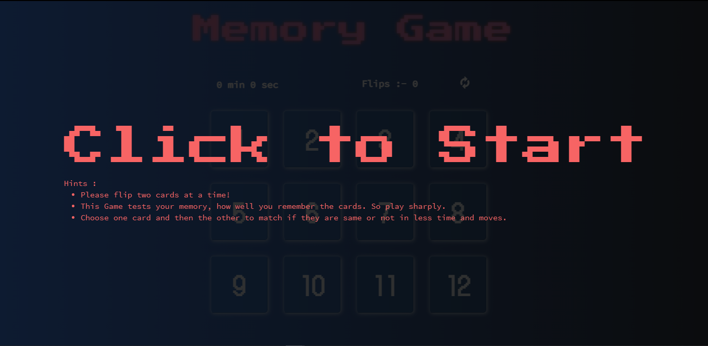

# Memory Game

The Memory Game Project is all about demonstrating your mastery of HTML, CSS, and JavaScript. You’ll build a complete browser-based card matching game (also known as Concentration). But this isn’t just any memory game! It’s a shnazzy, well-designed, feature-packed memory game!

The styling of the game is up to you, but here's what we came up with:

Starting screen.

## How The Game Works ?

The game board consists of sixteen **cards** arranged in a grid. The deck is made up of _twelve_ different pairs of cards, each with different symbols on one side. The cards are arranged randomly on the grid with the symbol face down. The gameplay rules are very simple: flip over two hidden cards at a time to locate the ones that match!

Each Turn :

- The player flips one card over to reveal its underlying symbol.
- The player then turns over a second card, trying to find the corresponding card with the same symbol.
- If the cards match, both cards stay flipped over.
- If the cards do not match, both cards are flipped face down.

The game ends once all cards have been correctly matched.

## Game Visuals

The Game layout is created with **flex-box** layout design of _CSS_. For more interactivity :-

- [**tsParticle.js**](https://particles.js.org/) is used for particles effects of bouncing balls in the background.

- [**vanilla-tilt.js**](https://micku7zu.github.io/vanilla-tilt.js/) is used for cards to add some exciting interesting glassmorphic tilt effect.

## Game Functionality

The real-life game, players flip over cards to locate the pairs that match The goal is to recreate this effect in your project. There are a couple of interactions that you'll need to handle:

- Flipping cards

- What happens when cards match

- What happens when cards do not match

- When the game finishes

Below are some examples of how we implemented these interactions.

### Fliped Cards

### Correct Guess

### Incorrect Guess

### Winning The Game

## What I Learn from this Project ?

The memory game presents the first opportunity to fully combine your skills in HTML, CSS, and JavaScript into a large project. Aside from solidifying your skills with these three technologies, you'll discover how best to combine them in a complex application.

The following are just some of the questions that you'll experience along the way:

- What's the ideal workflow?

- How many files do I need?

- Do I modify the HTML first or the CSS?

- How many JavaScript functions do I need?

- Should my function be this many lines of code?

- How to implement open source libraries of javascript in our own project?

## Development Strategy (An instruction)

It's very important that you plan your project before you start writing any code. Break your project down into small pieces of work and plan out your approach to each one. It's much easier to debug and fix an issue if you've only made a small change. It becomes much harder if you wait longer to test your code. You don't build a house all at once, but brick by brick.

- Start by building a very simple grid of cards.
  - Don't worry about styling, just get something clickable on the page.
  - Figure out the HTML needed to represent a card. Remember, you have to represent two sides of the card. Are you going to have two separate elements stacked on top of each other?
- Add the functionality to handle clicks.
  - This should reveal the hidden side of each card.
- Work on the matching logic. How does your game "know" if a player guesses correctly or incorrectly?
- Work on the winning condition. How does your game “know” if a player has won?
- We recommend saving styling until the very end. Allow your game logic and functionality to dictate the styling.

### Link to the Project :-

[**Memory-Game**](https://pyk017.github.io/Memory-Game/)
